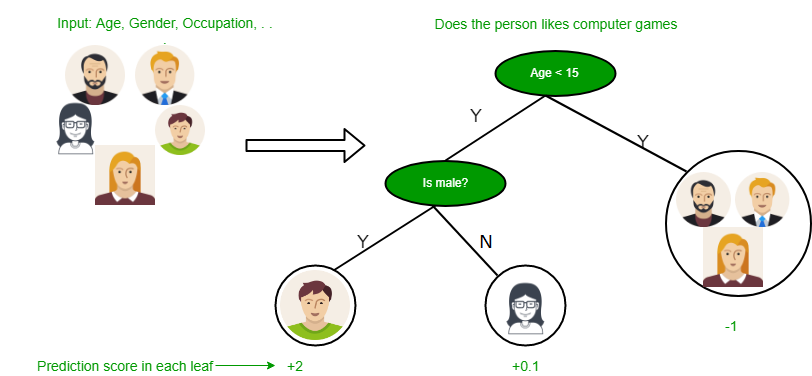
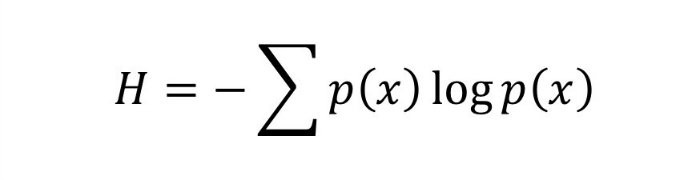

## Decision Tree
Decision tree algorithm falls under the category of supervised learning. They can be used to solve both regression and classification problems.

Decision tree uses the tree representation to solve the problem in which each leaf node corresponds to a class label and attributes are represented on the internal node of the tree.

We can represent any boolean function on discrete attributes using the decision tree.

In Decision Tree the major challenge is to identification of the attribute for the root node in each level. This process is known as attribute selection. We have two popular attribute selection measures:

1.Information Gain

2.Gini Index

### Entropy
Entropy is degree of randomness of elements or in other words it is measure of impurity. Mathematically, it can be calculated with the help of probability of the items as:

For example,  

if we have items as number of dice face occurrence in a throw event as 1123, the entropy is

   p(1) = 0.5  
   
   p(2) = 0.25
   
   p(3) = 0.25
   
entropy = - (0.5 * log(0.5)) - (0.25 * log(0.25)) -(0.25 * log(0.25)

        = 0.45

### Information Gain
Suppose we have multiple features to divide the current working set, the information gain at any node is defined as

**Information Gain (n) = Entropy(x) — ([weighted average] * entropy(children for feature))**

download the dataset from https://gist.github.com/bigsnarfdude/515849391ad37fe593997fe0db98afaa

## References:

https://github.com/Madhu009/Deep-math-machine-learning.ai/blob/master/DecisionTreeAlgorithms_Scratch.ipynb

https://www.geeksforgeeks.org/decision-tree-introduction-example/

https://medium.com/machine-learning-101/chapter-3-decision-trees-theory-e7398adac567
